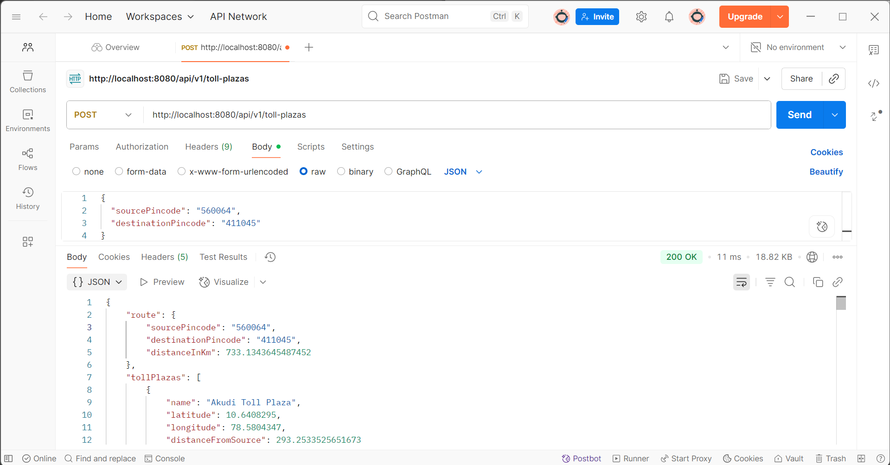
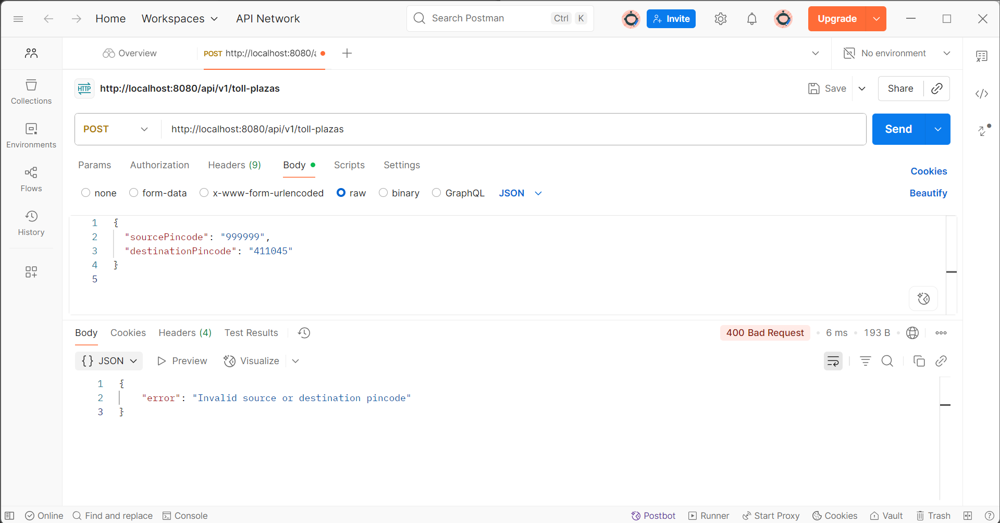
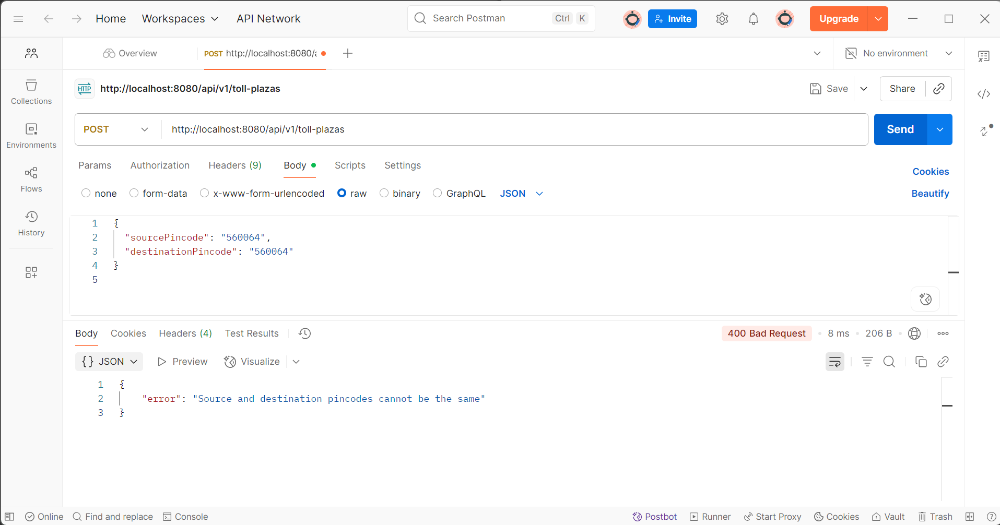

# Toll Plaza Locator API

A Java Spring Boot RESTful API to find toll plazas on the route between two Indian pincodes. The API dynamically filters toll plazas based on the route distance using adaptive geographical filtering, delivering precise results with robust error handling.

## Project Overview

This project aims to provide a backend REST API that, given two Indian pincodes as source and destination, calculates the route distance and returns a filtered list of toll plazas located within an adaptive radius around the source location. The filtering radius scales dynamically based on the route distance, ensuring relevant toll plazas are returned without overwhelming results.

---

## Features

- RESTful API with JSON communication.  
- Adaptive filtering radius based on route distance with caps and buffer.  
- Data sourced from Indian pincodes and toll plazas CSV files.  
- Robust validation for pincodes and route inputs.  
- Proper error handling with meaningful messages.  
- Basic unit tests using JUnit to verify key functionality.  
- Modular and clean codebase following best design practices.

---

## Technology Stack

- Java 11+  
- Spring Boot 2.x  
- Maven (build & dependency management)  
- JUnit 5 (unit testing)  
- CSV data files (for pincodes & toll plazas)  
- Git & GitHub for version control

---

## Setup & Running the Project

### Prerequisites

- Java 11 or newer installed  
- Maven installed  
- Git installed (optional, for cloning repository)

### Steps

1. Clone the repository:

```
git clone https://github.com/SekharSunkara6/Toll-Plaza-Locator.git
cd Toll-Plaza-Locator
```

2. Build the project:

```
mvn clean install
```

3. Run the application:

```
mvn spring-boot:run
```

4. The API server starts on `http://localhost:8080`

---

## API Documentation

### Endpoint: Get Toll Plazas on Route

**POST** `/api/v1/toll-plazas`

**Request Body Example**:

```
{
  "sourcePincode": "560064",
  "destinationPincode": "411045"
}
```

**Response Example**:

```
{
  "route": {
    "sourcePincode": "560064",
    "destinationPincode": "411045",
    "distanceInKm": 733.13
  },
  "tollPlazas": [
    {
      "name": "Some Toll Plaza",
      "latitude": 17.0,
      "longitude": 75.0,
      "distanceFromSource": 150.3
    }
    // More toll plazas
  ]
}
```

---

## Testing

- Use **Postman** or similar tools to POST requests to the API.  
- Included comprehensive unit tests using JUnit 5 in `src/test/java/` for key service components.  
- Run tests using Maven:

```
mvn test
```

---

## Error Handling

| Error Scenario                | Response Example                                   |
|------------------------------|---------------------------------------------------|
| Same source and destination   | `{ "error": "Source and destination pincodes cannot be the same" }` |
| Invalid pincodes              | `{ "error": "Invalid source or destination pincode" }`            |
| Missing required fields       | HTTP 400 with validation error messages              |

---

## Project Folder Structure

```
Toll-Plaza-Locator/
├── .mvn/                             # Maven wrapper files to run maven without install
├── src/
│   ├── main/
│   │   ├── java/
│   │   │   └── com/
│   │   │       └── example/
│   │   │           └── tollplaza/
│   │   │               ├── controller/        # REST controllers handling API requests
│   │   │               ├── dto/               # Data Transfer Objects for API
│   │   │               ├── model/             # Data models/entities
│   │   │               ├── service/           # Business logic services
│   │   │               ├── util/              # Utility/helper classes (e.g., CSV loading, geo utils)
│   │   │               └── TollPlazaLocatorApplication.java  # Main Spring Boot application class
│   │   ├── resources/
│   │   │   ├── indian_pincodes.csv            # Indian pincodes data file
│   │   │   ├── toll_plaza_india.csv            # Toll plazas data file
│   │   │   └── application.properties          # Spring Boot config properties
│   ├── test/
│   │   ├── java/
│   │   │   └── com/
│   │   │       └── example/
│   │   │           └── tollplaza/
│   │   │               ├── controller/        # Controller tests (JUnit)
│   │   │               ├── service/           # Service layer tests (JUnit)
│   │   │               └── TollPlazaLocatorApplicationTests.java  # Integration test
│   │   └── resources/                          # Test resource files (if any)
├── images/                                    # Folder for screenshots & proof images
│   └── screenshots/
│       ├── working_request.png                 # Screenshot of successful API response
│       ├── invalid_pincode_error.png           # Screenshot showing invalid pincode error
│       └── same_pincode_error.png               # Screenshot showing same pincode error
├── .gitignore                                 # Git ignore file
├── mvnw, mvnw.cmd                             # Maven wrapper executables
├── pom.xml                                    # Maven project descriptor
└── README.md                                  # Project documentation
```

## Screenshots

### 1. Working Request - Valid Pincodes



---

### 2. Error - Invalid Pincode



---

### 3. Error - Same Pincodes



---

## Future Improvements

- Add integration tests covering API controllers  
- Implement advanced filtering based on actual route polyline  
- Add database persistence with efficient upsert operations  
- Enhance test coverage for edge cases and performance  
- Setup CI/CD pipeline for automated build and test

---

## Author

**Sekhar Sunkara**

- GitHub: https://github.com/SekharSunkara6  
- Email: sekharsunkara2002@gmail.com
- Portfolio: https://sekharsunkaraportfolio.netlify.app/

---

Thank you for reviewing this project!
